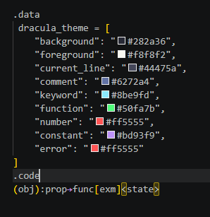

# VibeDSL


VibeDSL is a semantic, NLP-based, domain-specific language — a logic constructor
for tasks, rules and architectures that must be passed clearly to an AI. It is
designed for both AI and humans: a human can write it by hand, and a minimal set
of precise instructions is enough for an AI to assemble the logic.

**Version:** 2.0.0 beta · **License:** [Apache 2.0](LICENSE)

The language is a two-dimensional diagram in text: nodes, arrows and indentation
form two axes, like a Miro whiteboard. The third axis (Z) holds states.

A file may carry two kinds of content. The `.data` block holds anything at all —
a theme, a table, a note, a fragment of another language — and none of it is
compiled. The `.code` block holds the records. The cut is by tag, once, and
both blocks are root.



## The record

One line, five marks, in this order:

```
(a):b->c[d]<e>
 |  | |  |  |
 |  | |  |  e   state, free text
 |  | |  d     hint, free text
 |  | c        function
 |  |b         property
 a             object, nothing may come before it
```

`->` and `→` are the same arrow and both are accepted. The file on disk keeps
whichever was written; the arrow is never rewritten.

A long record may be wrapped by hand. The rule is the arrow, not a mark:

```
(a):b
    ->c[d]<e>
```

A line with no arrow, followed by a line that opens with one, is half a record.
The two halves are joined before parsing. Two whole records in a row are never
joined — a whole record is not half of one.

Full rules and the checks they are held to: [5xVector/specs/two-blocks.md](5xVector/specs/two-blocks.md).
